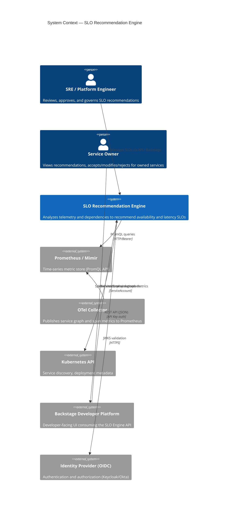
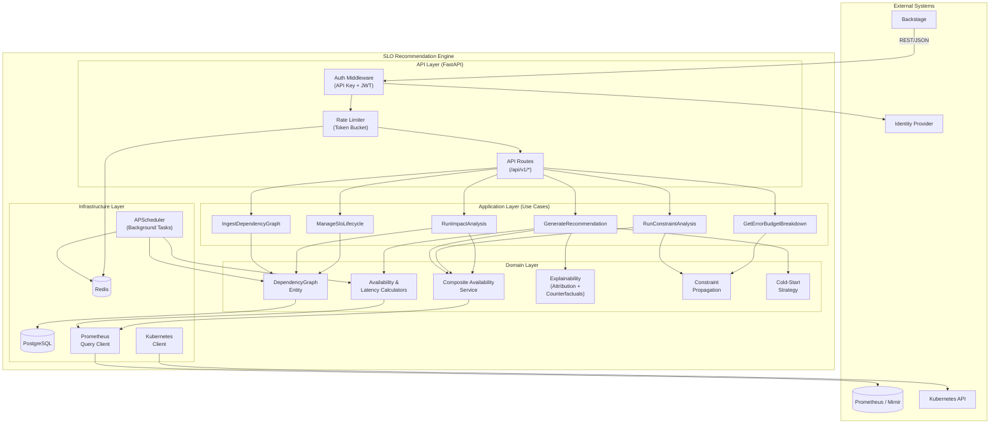
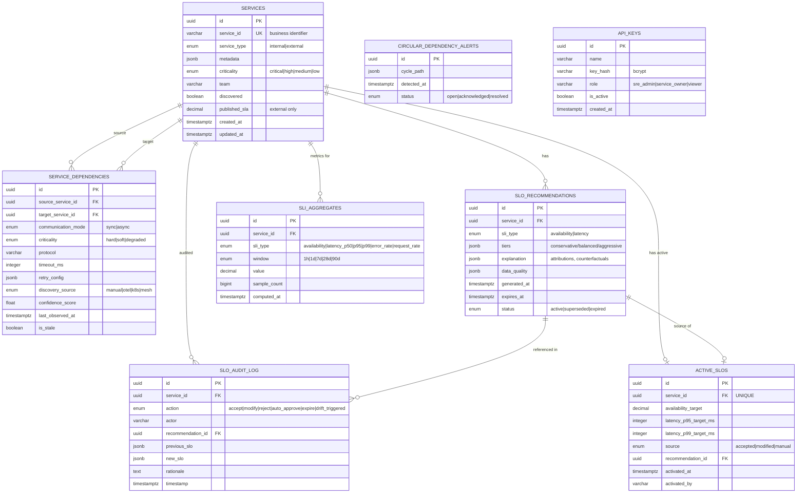
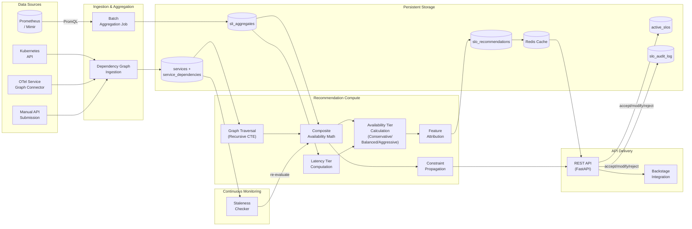
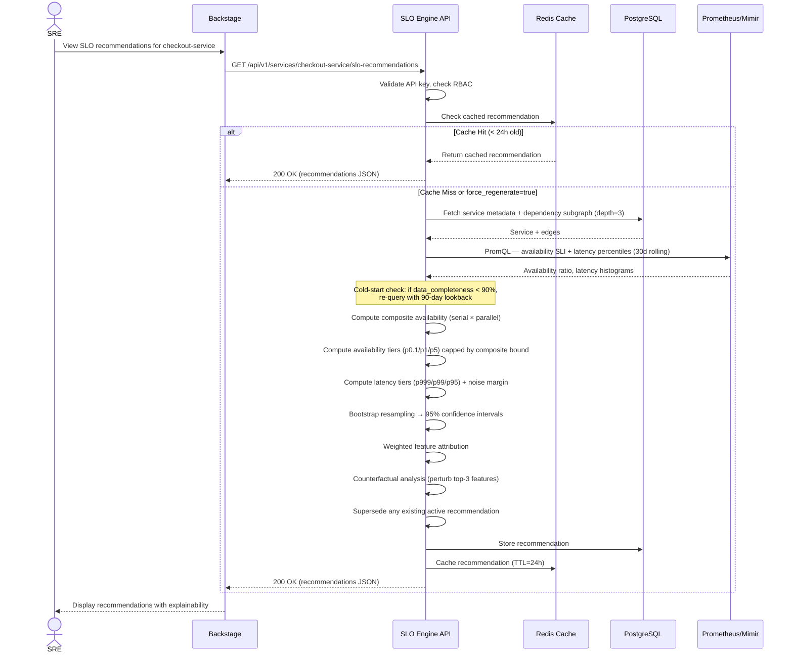
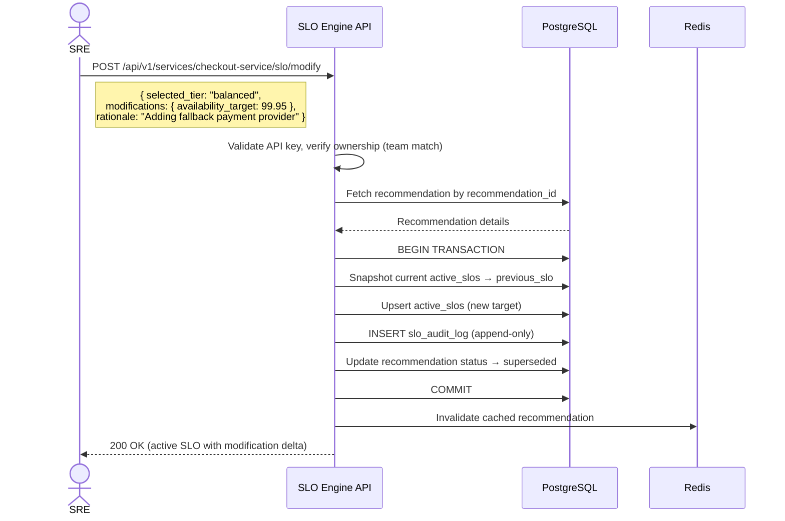
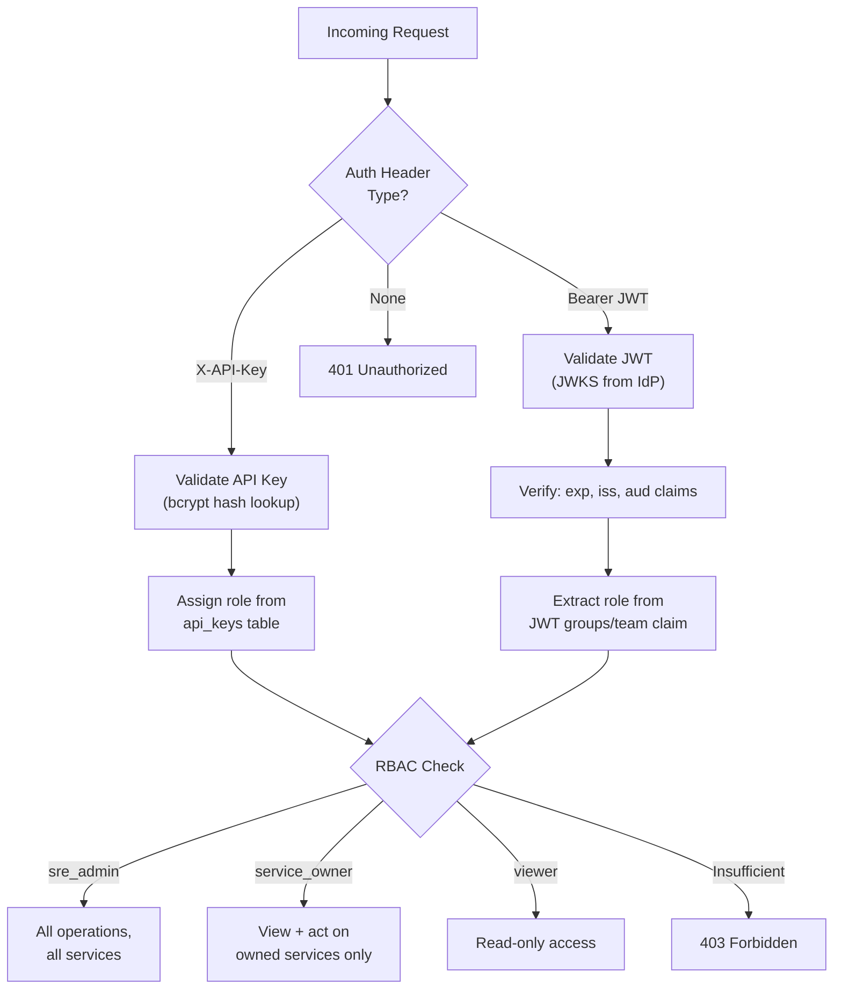
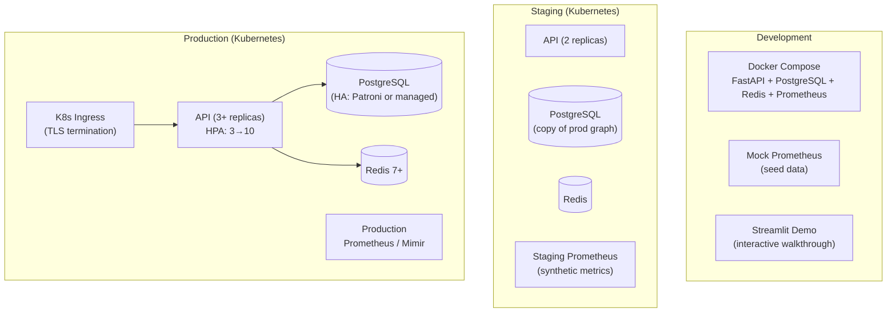

# System Design Document (SDD) — SLO Recommendation Engine

> **Version:** 2.0
> **Date:** 2026-03-02
> **Status:** Draft
> **References:** [PRD](../1_product/PRD.md) | [TRD](./TRD.md)

---

## 1. Problem Statement & Requirements

### What We Are Building

The SLO Recommendation Engine is an AI-assisted backend system that analyzes telemetry data and structural dependencies across 500-5,000+ interconnected microservices to recommend achievable **availability and latency SLOs** for each service.

### Why It Exists

In cloud-native organizations at scale, SLO setting is manual, error-prone, and fails to account for the interconnected nature of distributed systems:

1. **Dependencies are invisible** — A checkout service depending on an unreliable external payment API inherits that unreliability, yet its SLO is set independently.
2. **Cascading failures are not modeled** — Four services at 99.9% each yield ~99.6% composite, but SLOs are set in isolation.
3. **SLOs become stale** — Deployments, traffic growth, and infrastructure shifts continuously move performance baselines.
4. **Latency composition is non-linear** — Tail latency amplifies across call chains; five parallel calls each at p99 < 100ms yield only 95% chance all finish under 100ms.

### Key Technical Challenges Shaping the Architecture

| Challenge | Architectural Implication |
|-----------|--------------------------|
| Dependency-aware computation | Graph storage with efficient traversal (recursive CTEs, cycle detection) |
| Composite reliability math | Serial/parallel availability formulas + percentile-based latency with noise margins |
| Explainability requirement | Weighted feature attribution, counterfactual analysis, data provenance tracking |
| Semi-automated governance | Full audit trail, human-on-the-loop approval workflow, graduation path to automation |
| Scale (5,000+ services) | Pre-computed aggregates, caching, async background processing |
| Integration with existing stack | Query Prometheus/Mimir — do not duplicate telemetry data |

---

## 2. High-Level Architecture Overview

The system follows **Clean Architecture** principles with three distinct layers (Domain → Application → Infrastructure) and integrates with an existing OpenTelemetry + Prometheus + Grafana observability stack.

### System Context Diagram


```mermaid
C4Context
    title System Context — SLO Recommendation Engine

    Person(sre, "SRE / Platform Engineer", "Reviews, approves, and governs SLO recommendations")
    Person(dev, "Service Owner", "Views recommendations, accepts/modifies/rejects for owned services")

    System(slo_engine, "SLO Recommendation Engine", "Analyzes telemetry and dependencies to recommend availability and latency SLOs")

    System_Ext(prometheus, "Prometheus / Mimir", "Time-series metric store (PromQL API)")
    System_Ext(otel, "OTel Collector", "Publishes service graph and span metrics to Prometheus")
    System_Ext(k8s, "Kubernetes API", "Service discovery, deployment metadata")
    System_Ext(backstage, "Backstage Developer Platform", "Developer-facing UI consuming the SLO Engine API")
    System_Ext(idp, "Identity Provider (OIDC)", "Authentication and authorization (Keycloak/Okta)")

    Rel(sre, slo_engine, "Manages SLOs via API / Backstage")
    Rel(dev, backstage, "Views recommendations")
    Rel(backstage, slo_engine, "REST API (JSON)", "API Key auth")
    Rel(slo_engine, prometheus, "PromQL queries", "HTTP/Bearer")
    Rel(slo_engine, k8s, "Service/Deployment reads", "ServiceAccount")
    Rel(otel, prometheus, "Span metrics, service graph metrics")
    Rel(slo_engine, idp, "JWKS validation", "HTTPS")
```

### Architectural Style

The system is a **modular monolith** deployed as a single Kubernetes workload with an in-process background scheduler:

1. **API Server** — FastAPI application serving the REST API (async request handling)
2. **Background Scheduler** — APScheduler running in-process for periodic tasks (batch aggregation, stale edge detection, OTel graph ingestion)

Both share the same codebase and domain logic. This avoids premature microservice decomposition while maintaining clear separation of concerns through Clean Architecture layers. Migration to Celery with dedicated worker pods is planned when task volume exceeds 100 tasks/minute.

### Core Design Principle: Query, Don't Store

The single most important architectural decision is that the SLO Engine **queries existing Prometheus/Mimir metric stores** rather than ingesting raw telemetry. This:
- Eliminates data duplication across the organization
- Leverages existing infrastructure investment
- Reduces the system's operational footprint to PostgreSQL + Redis + the application itself

---

## 3. System Components & Services

### Component Diagram


```mermaid
graph TD
    subgraph External["External Systems"]
        PROM[("Prometheus / Mimir")]
        K8S["Kubernetes API"]
        IDP["Identity Provider"]
        BACKSTAGE["Backstage"]
    end

    subgraph SLO_ENGINE["SLO Recommendation Engine"]
        subgraph API_LAYER["API Layer (FastAPI)"]
            AUTH["Auth Middleware<br/>(API Key + JWT)"]
            RATE["Rate Limiter<br/>(Token Bucket)"]
            ROUTES["API Routes<br/>(/api/v1/*)"]
        end

        subgraph APP_LAYER["Application Layer (Use Cases)"]
            UC_INGEST["IngestDependencyGraph"]
            UC_RECOMMEND["GenerateRecommendation"]
            UC_CONSTRAINT["RunConstraintAnalysis"]
            UC_IMPACT["RunImpactAnalysis"]
            UC_LIFECYCLE["ManageSloLifecycle"]
            UC_BUDGET["GetErrorBudgetBreakdown"]
        end

        subgraph DOMAIN["Domain Layer"]
            DEP_GRAPH["DependencyGraph<br/>Entity"]
            SLO_CALC["Availability &<br/>Latency Calculators"]
            COMPOSITE["Composite Availability<br/>Service"]
            EXPLAIN["Explainability<br/>(Attribution +<br/>Counterfactuals)"]
            CONSTRAINT["Constraint<br/>Propagation"]
            COLD["Cold-Start<br/>Strategy"]
        end

        subgraph INFRA["Infrastructure Layer"]
            PG[("PostgreSQL")]
            REDIS[("Redis")]
            PROM_CLIENT["Prometheus<br/>Query Client"]
            K8S_CLIENT["Kubernetes<br/>Client"]
            SCHEDULER["APScheduler<br/>(Background Tasks)"]
        end
    end

    BACKSTAGE -->|REST/JSON| AUTH
    AUTH --> RATE --> ROUTES
    ROUTES --> UC_INGEST & UC_RECOMMEND & UC_CONSTRAINT & UC_IMPACT & UC_LIFECYCLE & UC_BUDGET
    UC_INGEST --> DEP_GRAPH
    UC_RECOMMEND --> SLO_CALC & COMPOSITE & EXPLAIN & COLD
    UC_CONSTRAINT --> COMPOSITE & CONSTRAINT
    UC_IMPACT --> COMPOSITE & DEP_GRAPH
    UC_LIFECYCLE --> DEP_GRAPH
    UC_BUDGET --> CONSTRAINT
    DEP_GRAPH --> PG
    SLO_CALC --> PROM_CLIENT
    COMPOSITE --> PROM_CLIENT
    PROM_CLIENT --> PROM
    K8S_CLIENT --> K8S
    SCHEDULER --> DEP_GRAPH & SLO_CALC
    SCHEDULER --> REDIS
    AUTH --> IDP
    RATE --> REDIS
```

### Component Responsibilities

| Component | Responsibility | Layer |
|-----------|---------------|-------|
| **Auth Middleware** | Validates API keys (bcrypt-hashed) and JWT tokens (OIDC/JWKS). Enforces RBAC (sre_admin, service_owner, viewer). | Infrastructure |
| **Rate Limiter** | Token-bucket rate limiting per client/endpoint. In-memory for MVP; Redis-backed planned for multi-replica. | Infrastructure |
| **API Routes** | FastAPI route handlers. Input validation via Pydantic. OpenAPI 3.0 auto-generation. RFC 7807 error responses. | Infrastructure |
| **IngestDependencyGraph** | Validates, merges, and upserts dependency graph from multiple sources (manual, OTel, K8s). Auto-creates discovered services. Triggers Tarjan's SCC detection. | Application |
| **GenerateRecommendation** | Orchestrates the full recommendation pipeline: validate service → check cold-start → fetch SLI data → retrieve subgraph → compute composite bounds → calculate tiers → generate attributions & counterfactuals → supersede old recommendations. | Application |
| **RunConstraintAnalysis** | Classifies dependencies (hard/soft, internal/external), resolves external availabilities with adaptive buffer, computes composite bound, error budget breakdown, unachievability detection, and cycle identification. | Application |
| **RunImpactAnalysis** | Reverse-traverses the graph to identify upstream services affected by a proposed SLO change. Recomputes composite bounds with proposed vs. current targets. | Application |
| **ManageSloLifecycle** | Handles accept/modify/reject workflow. Writes to append-only audit log. Upserts active SLOs. | Application |
| **GetErrorBudgetBreakdown** | Returns per-dependency error budget consumption with risk classification. | Application |
| **DependencyGraph Entity** | Domain model for the service graph. Encodes nodes, edges with annotations (communication_mode, criticality, discovery_source, confidence_score, staleness). | Domain |
| **Availability Calculator** | Percentile-based availability tier computation (p0.1/p1/p5), breach probability estimation, bootstrap confidence intervals (1000 resamples), error budget in monthly minutes. | Domain |
| **Latency Calculator** | Percentile-based latency tier computation (p999/p99/p95) with noise margins (5% default, 10% shared infrastructure). Bootstrap confidence intervals. | Domain |
| **Composite Availability Service** | Serial (R = R_self × R_dep1 × R_dep2) and parallel (R = 1-(1-R1)(1-R2)) composite math. Bottleneck identification. Soft dependencies excluded from bound. | Domain |
| **Explainability Engine** | Weighted feature attribution (heuristic MVP weights, SHAP planned Phase 5), counterfactual "what-if" analysis via perturbation of top-3 contributing features, data provenance metadata. | Domain |
| **Constraint Propagation** | External API adaptive buffer service (10x pessimistic margin), unachievable SLO detector (10x rule), error budget analyzer (per-dependency risk: LOW/MODERATE/HIGH). | Domain |
| **Cold-Start Strategy** | Detects data completeness < 90% over 30-day window. Auto-extends lookback to 90 days. Flags low confidence in data quality. | Domain |
| **Circular Dependency Detector** | Iterative Tarjan's algorithm for finding strongly connected components. O(V+E) complexity. Non-blocking (stored as alerts). | Domain |
| **Prometheus Query Client** | PromQL query builder against Prometheus/Mimir remote read API. | Infrastructure |
| **APScheduler** | In-process background scheduler: periodic OTel graph ingestion (15 min), stale edge detection (168h threshold), batch recommendation computation (24h). | Infrastructure |

---

## 4. Data Architecture

### 4.1 Data Models (ERD)


```mermaid
erDiagram
    SERVICES {
        uuid id PK
        varchar service_id UK "business identifier"
        enum service_type "internal|external"
        jsonb metadata
        enum criticality "critical|high|medium|low"
        varchar team
        boolean discovered
        decimal published_sla "external only"
        timestamptz created_at
        timestamptz updated_at
    }

    SERVICE_DEPENDENCIES {
        uuid id PK
        uuid source_service_id FK
        uuid target_service_id FK
        enum communication_mode "sync|async"
        enum criticality "hard|soft|degraded"
        varchar protocol
        integer timeout_ms
        jsonb retry_config
        enum discovery_source "manual|otel|k8s|mesh"
        float confidence_score
        timestamptz last_observed_at
        boolean is_stale
    }

    SLO_RECOMMENDATIONS {
        uuid id PK
        uuid service_id FK
        enum sli_type "availability|latency"
        jsonb tiers "conservative/balanced/aggressive"
        jsonb explanation "attributions, counterfactuals"
        jsonb data_quality
        timestamptz generated_at
        timestamptz expires_at
        enum status "active|superseded|expired"
    }

    ACTIVE_SLOS {
        uuid id PK
        uuid service_id FK "UNIQUE"
        decimal availability_target
        integer latency_p95_target_ms
        integer latency_p99_target_ms
        enum source "accepted|modified|manual"
        uuid recommendation_id FK
        timestamptz activated_at
        varchar activated_by
    }

    SLO_AUDIT_LOG {
        uuid id PK
        uuid service_id FK
        enum action "accept|modify|reject|auto_approve|expire|drift_triggered"
        varchar actor
        uuid recommendation_id FK
        jsonb previous_slo
        jsonb new_slo
        text rationale
        timestamptz timestamp
    }

    SLI_AGGREGATES {
        uuid id PK
        uuid service_id FK
        enum sli_type "availability|latency_p50|p95|p99|error_rate|request_rate"
        enum window "1h|1d|7d|28d|90d"
        decimal value
        bigint sample_count
        timestamptz computed_at
    }

    CIRCULAR_DEPENDENCY_ALERTS {
        uuid id PK
        jsonb cycle_path
        timestamptz detected_at
        enum status "open|acknowledged|resolved"
    }

    API_KEYS {
        uuid id PK
        varchar name
        varchar key_hash "bcrypt"
        varchar role "sre_admin|service_owner|viewer"
        boolean is_active
        timestamptz created_at
    }

    SERVICES ||--o{ SERVICE_DEPENDENCIES : "source"
    SERVICES ||--o{ SERVICE_DEPENDENCIES : "target"
    SERVICES ||--o{ SLO_RECOMMENDATIONS : "has"
    SERVICES ||--o| ACTIVE_SLOS : "has active"
    SERVICES ||--o{ SLI_AGGREGATES : "metrics for"
    SERVICES ||--o{ SLO_AUDIT_LOG : "audited"
    SLO_RECOMMENDATIONS ||--o{ SLO_AUDIT_LOG : "referenced in"
    SLO_RECOMMENDATIONS ||--o| ACTIVE_SLOS : "source of"
```

### 4.2 Data Flow


```mermaid
flowchart LR
    subgraph SOURCES["Data Sources"]
        PROM_SRC[("Prometheus<br/>/ Mimir")]
        K8S_SRC["Kubernetes<br/>API"]
        OTEL_SRC["OTel Service<br/>Graph Connector"]
        MANUAL["Manual API<br/>Submission"]
    end

    subgraph INGESTION["Ingestion & Aggregation"]
        BATCH["Batch<br/>Aggregation Job"]
        GRAPH_INGEST["Dependency Graph<br/>Ingestion"]
    end

    subgraph STORAGE["Persistent Storage"]
        PG_AGG[("sli_aggregates")]
        PG_GRAPH[("services +<br/>service_dependencies")]
        PG_RECS[("slo_recommendations")]
        PG_SLOS[("active_slos")]
        PG_AUDIT[("slo_audit_log")]
        REDIS_CACHE[("Redis Cache")]
    end

    subgraph COMPUTE["Recommendation Compute"]
        GRAPH_TRAVERSE["Graph Traversal<br/>(Recursive CTE)"]
        COMPOSITE["Composite<br/>Availability Math"]
        LATENCY["Latency Tier<br/>Computation"]
        TIERS["Availability Tier<br/>Calculation<br/>(Conservative/<br/>Balanced/Aggressive)"]
        ATTR_ENG["Feature<br/>Attribution"]
        CONSTRAINT_ENG["Constraint<br/>Propagation"]
    end

    subgraph DELIVERY["API Delivery"]
        REST_API["REST API<br/>(FastAPI)"]
        BACKSTAGE_INT["Backstage<br/>Integration"]
    end

    subgraph CONTINUOUS["Continuous Monitoring"]
        STALE_CHECK["Staleness<br/>Checker"]
    end

    PROM_SRC -->|PromQL| BATCH
    K8S_SRC --> GRAPH_INGEST
    OTEL_SRC --> GRAPH_INGEST
    MANUAL --> GRAPH_INGEST

    BATCH --> PG_AGG
    GRAPH_INGEST --> PG_GRAPH

    PG_AGG --> COMPOSITE & LATENCY
    PG_GRAPH --> GRAPH_TRAVERSE
    GRAPH_TRAVERSE --> COMPOSITE

    COMPOSITE --> TIERS
    LATENCY --> TIERS
    TIERS --> ATTR_ENG
    ATTR_ENG --> PG_RECS
    PG_RECS --> REDIS_CACHE

    COMPOSITE --> CONSTRAINT_ENG
    CONSTRAINT_ENG --> REST_API

    REDIS_CACHE --> REST_API
    REST_API --> BACKSTAGE_INT

    REST_API -->|accept/modify/reject| PG_SLOS & PG_AUDIT

    PG_GRAPH --> STALE_CHECK
    STALE_CHECK -->|re-evaluate| COMPOSITE
```

### 4.3 Storage Strategy

| Store | Technology | Purpose | Rationale |
|-------|-----------|---------|-----------|
| **Primary Database** | PostgreSQL 16+ | Graph storage, SLO data, audit logs, SLI aggregates | Recursive CTEs for graph traversal. JSONB for flexible metadata. Partitioning support. |
| **Cache & Rate Limiting** | Redis 7+ | Recommendation cache (24h TTL), rate limit counters, distributed locks | Sub-millisecond reads for cached recommendations. |
| **Time-Series Metrics** | Prometheus / Mimir (external) | Historical SLI data, infrastructure metrics | **Queried, not owned.** Avoids data duplication. Leverages existing retention policies. |

**Partitioning:** `sli_aggregates` is partitioned by `computed_at` (monthly partitions). Hourly granularity retained for 90 days; daily aggregates retained for 1 year.

**Estimated Storage (5,000 services, 1 year):** ~70 GB total, dominated by `sli_aggregates` (~65 GB).

---

## 5. SLO Recommendation Algorithm

This section describes the core computation pipeline that powers the engine.

### 5.1 Availability Tier Computation

The engine generates **three recommendation tiers** using percentile analysis of historical rolling availability windows, capped by composite dependency bounds:

| Tier | Percentile | Composite Cap | Intent |
|------|-----------|---------------|--------|
| **Conservative** | p0.1 (floor) | Capped by composite bound | Easiest to meet; safe default |
| **Balanced** | p1 | Capped by composite bound | Moderate ambition |
| **Aggressive** | p5 | NOT capped | Aspirational; may require dependency improvements |

**Each tier includes:**
- **Target**: Availability percentage (e.g., 99.95%)
- **Error Budget**: Monthly minutes of allowed downtime = `(100% - target%) × 43,200 minutes`
- **Breach Probability**: Fraction of historical windows where target would have been breached
- **95% Confidence Interval**: Computed via bootstrap resampling (1,000 resamples)

**Why p0.1/p1/p5 (not p50/p90/p99)?** We're selecting from the *lower tail* of availability distributions. p0.1 represents a floor nearly all historical windows exceeded, while p5 represents a target only 95% of windows met — genuinely ambitious.

### 5.2 Latency Tier Computation

Latency tiers use historical percentile data with noise margins to account for infrastructure variability:

| Tier | Percentile | Noise Margin |
|------|-----------|-------------|
| **Conservative** | p999 | +10% (shared infra) or +5% (default) |
| **Balanced** | p99 | +10% or +5% |
| **Aggressive** | p95 | +10% or +5% |

The noise margin accounts for CFS throttling, noisy neighbors, and shared infrastructure effects that cause latency variance beyond application-level behavior.

### 5.3 Composite Availability Bound

The composite bound represents the **maximum achievable availability** given a service's dependency chain:

```
Serial (hard sync deps):    R_composite = R_self × R_dep1 × R_dep2 × ... × R_depN
Parallel (redundant paths): R_group = 1 - (1-R_primary)(1-R_fallback)
Mixed topology:             Apply parallel within groups, then serial across groups
```

**Key behaviors:**
- **Hard dependencies** (sync, criticality=hard): Included in composite math
- **Soft dependencies** (async, criticality=soft/degraded): Excluded from bound, noted as risk
- **Bottleneck identification**: The dependency with the lowest individual availability is flagged

**Example:** `checkout-service` (99.95%) → depends on `payment-service` (99.9%) and `inventory-service` (99.8%)
- Composite bound = 0.9995 × 0.999 × 0.998 = **99.65%**
- Bottleneck: `inventory-service` at 99.8%

### 5.4 Constraint Propagation (FR-3)

Constraint propagation answers: *"Given my dependency chain, is my desired SLO even achievable?"*

#### External API Adaptive Buffer

External dependencies (e.g., `external-payment-api`) receive a pessimistic adjustment because published SLAs are often overstated:

```
published_adjusted = 1 - (1 - published_sla) × 11    # 10x unavailability margin

effective = min(observed, published_adjusted)          # if both available
effective = observed                                    # if only observed
effective = published_adjusted                          # if only published
effective = 0.999                                       # if neither (conservative default)
```

**Example:** Stripe publishes 99.99% SLA → adjusted = 1 - (0.0001 × 11) = **99.89%**. If observed is 99.85%, effective = **99.85%** (the worse of the two).

#### Error Budget Breakdown

For each dependency, the engine computes what fraction of the parent service's error budget it consumes:

```
consumption_pct = (1 - dep_availability) / (1 - slo_target) × 100
```

Risk classification:
- **LOW** (green): < 20% of error budget consumed
- **MODERATE** (yellow): 20-30% consumed
- **HIGH** (red): > 30% consumed — triggers alert

#### Unachievable SLO Detection

Uses the **10x rule**: each component (service + N dependencies) gets an equal share of the error budget:

```
required_dep_availability = 1 - error_budget / (N + 1)
```

If the composite bound falls below the desired target, the engine generates:
1. A **warning message** with the gap (e.g., "99.99% desired but only 99.65% achievable")
2. **Remediation guidance**: add redundant paths, convert sync→async, or relax the target

### 5.5 Impact Analysis (FR-4)

Impact analysis answers: *"If I change this service's SLO, which upstream services are affected?"*

**Algorithm:**
1. Reverse-traverse the dependency graph to find all upstream consumers
2. For each upstream service, recompute composite availability with the **proposed** target substituted
3. Compare against the upstream service's own active SLO target
4. Flag services where projected composite drops below their SLO target as "at risk"
5. Sort results by absolute delta (most impacted first)

**Latency caveat:** Percentiles are non-additive (p99 of sum ≠ sum of p99s), so latency impact is flagged as requiring manual review rather than being computed mathematically.

### 5.6 Explainability (FR-7)

Every recommendation includes three explainability components:

#### Feature Attribution

MVP uses weighted heuristic attribution (SHAP values planned for Phase 5):

| Feature (Availability) | Weight | Description |
|------------------------|--------|-------------|
| `historical_availability_mean` | 0.40 | Primary driver — observed reliability |
| `downstream_dependency_risk` | 0.30 | Composite bound constraint |
| `external_api_reliability` | 0.15 | External dependency risk |
| `deployment_frequency` | 0.15 | Stability signal |

| Feature (Latency) | Weight | Description |
|-------------------|--------|-------------|
| `p99_latency_historical` | 0.50 | Primary driver — observed tail latency |
| `call_chain_depth` | 0.22 | Cascading delay from depth |
| `noisy_neighbor_margin` | 0.15 | Infrastructure noise |
| `traffic_seasonality` | 0.13 | Load pattern variability |

Contributions are normalized to sum to 1.0 and sorted by absolute contribution.

#### Counterfactual Analysis

Generates up to 3 "what-if" statements by perturbing the top contributing features:

> *"If historical availability improved by 0.5%, recommended target would increase to 99.97%"*
> *"If downstream dependency risk reduced by 0.5%, recommended target would increase to 99.96%"*

#### Data Provenance

Each recommendation records:
- Dependency graph version (timestamp of snapshot used)
- Telemetry window (start/end)
- Data completeness score (0.0-1.0)
- Computation method (e.g., `composite_reliability_math_v1`)
- Telemetry source

### 5.7 Cold-Start Strategy

For new services with insufficient historical data:

1. **Detection**: Data completeness < 90% over the default 30-day lookback window
2. **Mitigation**: Auto-extend lookback to 90 days to gather more data
3. **Flagging**: Mark recommendation with low confidence in data quality metadata

---

## 6. API Design

### Interaction Pattern

- **Protocol:** REST over HTTPS (TLS 1.3)
- **Specification:** OpenAPI 3.0, auto-generated from Pydantic models via FastAPI
- **Versioning:** URL path (`/api/v1/`)
- **Serialization:** JSON (`application/json`)
- **Pagination:** Cursor-based for list endpoints
- **Errors:** RFC 7807 Problem Details

### Endpoint Summary

| Method | Endpoint | Description | Latency Target |
|--------|----------|-------------|----------------|
| POST | `/api/v1/services/dependencies` | Bulk upsert dependency graph | < 30s |
| GET | `/api/v1/services/{id}/dependencies` | Get dependency subgraph | < 500ms |
| GET | `/api/v1/services/{id}/slo-recommendations` | Get SLO recommendations | < 500ms (cached), < 5s (regenerate) |
| POST | `/api/v1/services/{id}/constraint-analysis` | Run constraint propagation analysis | < 5s |
| GET | `/api/v1/services/{id}/error-budget-breakdown` | Get per-dependency error budget breakdown | < 500ms |
| POST | `/api/v1/services/{id}/impact-analysis` | Run cascading impact analysis | < 10s |
| POST | `/api/v1/services/{id}/slo/accept` | Accept a recommendation tier | < 500ms |
| POST | `/api/v1/services/{id}/slo/modify` | Modify and accept with custom targets | < 500ms |
| POST | `/api/v1/services/{id}/slo/reject` | Reject a recommendation | < 500ms |
| GET | `/api/v1/services/{id}/slo/audit-history` | View SLO change audit trail | < 500ms |
| GET | `/api/v1/health` | Liveness check | < 50ms |
| GET | `/api/v1/health/ready` | Readiness check (DB + Redis) | < 200ms |

**Key query parameters:**
- `sli_type`: `availability`, `latency`, or `all` (default)
- `lookback_days`: 7-365 (default 30)
- `force_regenerate`: boolean — bypass cache and recompute
- `max_depth`: 1-10 for subgraph traversal (default 3)
- `direction`: `upstream`, `downstream`, or `both`

### Critical Flow: SLO Recommendation Generation


```mermaid
sequenceDiagram
    actor SRE
    participant Backstage
    participant API as SLO Engine API
    participant Cache as Redis Cache
    participant DB as PostgreSQL
    participant Prom as Prometheus/Mimir

    SRE->>Backstage: View SLO recommendations for checkout-service
    Backstage->>API: GET /api/v1/services/checkout-service/slo-recommendations
    API->>API: Validate API key, check RBAC

    API->>Cache: Check cached recommendation
    alt Cache Hit (< 24h old)
        Cache-->>API: Return cached recommendation
        API-->>Backstage: 200 OK (recommendations JSON)
    else Cache Miss or force_regenerate=true
        API->>DB: Fetch service metadata + dependency subgraph (depth=3)
        DB-->>API: Service + edges

        API->>Prom: PromQL — availability SLI + latency percentiles (30d rolling)
        Prom-->>API: Availability ratio, latency histograms

        Note over API: Cold-start check: if data_completeness < 90%,<br/>re-query with 90-day lookback

        API->>API: Compute composite availability (serial × parallel)
        API->>API: Compute availability tiers (p0.1/p1/p5) capped by composite bound
        API->>API: Compute latency tiers (p999/p99/p95) + noise margin
        API->>API: Bootstrap resampling → 95% confidence intervals
        API->>API: Weighted feature attribution
        API->>API: Counterfactual analysis (perturb top-3 features)
        API->>API: Supersede any existing active recommendation

        API->>DB: Store recommendation
        API->>Cache: Cache recommendation (TTL=24h)
        API-->>Backstage: 200 OK (recommendations JSON)
    end

    Backstage-->>SRE: Display recommendations with explainability
```

### Critical Flow: Accept / Modify / Reject Workflow


```mermaid
sequenceDiagram
    actor SRE
    participant API as SLO Engine API
    participant DB as PostgreSQL
    participant Cache as Redis

    SRE->>API: POST /api/v1/services/checkout-service/slo/modify
    Note right of SRE: { selected_tier: "balanced",<br/>modifications: { availability_target: 99.95 },<br/>rationale: "Adding fallback payment provider" }

    API->>API: Validate API key, verify ownership (team match)
    API->>DB: Fetch recommendation by recommendation_id
    DB-->>API: Recommendation details

    API->>DB: BEGIN TRANSACTION
    API->>DB: Snapshot current active_slos → previous_slo
    API->>DB: Upsert active_slos (new target)
    API->>DB: INSERT slo_audit_log (append-only)
    API->>DB: Update recommendation status → superseded
    API->>DB: COMMIT

    API->>Cache: Invalidate cached recommendation
    API-->>SRE: 200 OK (active SLO with modification delta)
```

---

## 7. Technology Stack

| Layer | Technology | Version | Rationale |
|-------|-----------|---------|-----------|
| **Language** | Python | 3.13+ | Team expertise. Rich ML/data ecosystem. Full async/await support. |
| **API Framework** | FastAPI | 0.115+ | Async-native, auto-generated OpenAPI docs, Pydantic validation. |
| **ORM** | SQLAlchemy | 2.0+ | Async support (AsyncPG), mature PostgreSQL integration, type-safe queries. |
| **Database** | PostgreSQL | 16+ | Recursive CTEs for graph traversal, JSONB for flexible metadata, table partitioning. |
| **Cache** | Redis | 7+ | Sub-ms reads, health checks, future rate limiting and caching. |
| **Background Tasks** | APScheduler | 3.10+ | In-process scheduling for MVP. Periodic OTel ingestion (15 min), stale edge detection, batch recommendations (24h). Migration to Celery planned at scale. |
| **ML / Explainability** | scipy, statistics (stdlib) | Latest stable | Bootstrap resampling, percentile computation. SHAP and scikit-learn deferred to Phase 5. |
| **Telemetry Client** | prometheus-api-client | Latest | PromQL queries against Prometheus/Mimir. Mock client for demo/testing. |
| **Migrations** | Alembic | Latest | SQLAlchemy-native schema versioning. All migrations reversible. |
| **Containerization** | Docker | Latest | Multi-stage builds (base → api). |
| **Orchestration** | Kubernetes | 1.28+ | Deployment, HPA scaling, health checks, rolling updates. |
| **CI/CD** | GitHub Actions | N/A | Build, test (pytest), lint (ruff), type-check (mypy --strict), security scan (bandit + pip-audit). |

---

## 8. Dependency Modeling

### Graph Schema

Services and their dependencies are stored in PostgreSQL with the following edge annotations:

| Annotation | Values | Impact on Computation |
|-----------|--------|----------------------|
| **communication_mode** | `sync` / `async` | Async deps excluded from composite availability math |
| **criticality** | `hard` / `soft` / `degraded` | Only `hard` deps included in composite bound |
| **discovery_source** | `manual` / `otel` / `k8s` / `mesh` | Multi-source edges merged; confidence based on source count |
| **confidence_score** | 0.0-1.0 | Higher when confirmed by multiple sources |
| **is_stale** | boolean | Stale edges (not observed in 168h) excluded from queries |
| **service_type** | `internal` / `external` | External deps trigger adaptive buffer strategy |

### Multi-Source Discovery & Edge Merging

Dependencies are discovered from multiple sources and merged:
1. **Manual API submission** — highest authority, team-declared
2. **OTel Service Graph** — extracted from Prometheus `traces_service_graph_request_total` metric
3. **Kubernetes API** — service-to-service references from deployment specs
4. **Service mesh** — (future) sidecar-level dependency maps

When the same edge is reported by multiple sources, confidence increases. Divergence between declared (manual) and observed (OTel) graphs triggers alerting.

### Circular Dependency Detection

Uses **iterative Tarjan's algorithm** (O(V+E)) to find all strongly connected components (SCCs) with size > 1. Cycles are stored as `CIRCULAR_DEPENDENCY_ALERTS` and surfaced in constraint analysis. The engine does not block on cycles — it detects and reports them as risk factors.

### Graph Traversal

Subgraph retrieval uses PostgreSQL **recursive CTEs** with:
- Configurable `max_depth` (1-10, default 3)
- Configurable `direction` (upstream, downstream, both)
- Partial index on `WHERE NOT is_stale` for performance
- Cycle prevention via path arrays in the CTE

---

## 9. Security Architecture

### Authentication & Authorization Flow


```mermaid
flowchart TD
    REQ["Incoming Request"] --> CHECK{"Auth Header<br/>Type?"}

    CHECK -->|X-API-Key| API_KEY["Validate API Key<br/>(bcrypt hash lookup)"]
    CHECK -->|Bearer JWT| JWT["Validate JWT<br/>(JWKS from IdP)"]
    CHECK -->|None| REJECT["401 Unauthorized"]

    API_KEY --> ROLE_API["Assign role from<br/>api_keys table"]
    JWT --> VERIFY["Verify: exp, iss, aud claims"]
    VERIFY --> ROLE_JWT["Extract role from<br/>JWT groups/team claim"]

    ROLE_API & ROLE_JWT --> RBAC{"RBAC Check"}

    RBAC -->|sre_admin| ALL["All operations,<br/>all services"]
    RBAC -->|service_owner| OWNED["View + act on<br/>owned services only"]
    RBAC -->|viewer| READ["Read-only access"]
    RBAC -->|Insufficient| FORBID["403 Forbidden"]
```

### Security Controls

| Control | Implementation |
|---------|---------------|
| **Transport** | TLS 1.3 mandatory. HTTP → HTTPS redirect. HSTS header. |
| **API Key Storage** | bcrypt (cost factor 12). Raw keys never stored or logged. |
| **JWT Validation** | Signature verified against IdP JWKS endpoint. Token cache TTL: 5 min. |
| **Input Validation** | All inputs via Pydantic strict models. Max request body: 10 MB. |
| **SQL Injection** | SQLAlchemy ORM with parameterized queries only. No raw string interpolation. |
| **Audit Immutability** | `slo_audit_log` table: no UPDATE/DELETE grants at the database level. ORM enforces append-only. |
| **Rate Limiting** | Token bucket per client/endpoint. Ingestion: 10/min. Query: 60/min. Returns 429 with Retry-After. |
| **Secrets Management** | All secrets via environment variables or Kubernetes Secrets. Never in source code. |

---

## 10. Deployment Architecture

### Environment Topology


```mermaid
graph TB
    subgraph DEV["Development"]
        DEV_COMPOSE["Docker Compose<br/>FastAPI + PostgreSQL + Redis + Prometheus"]
        DEV_MOCK["Mock Prometheus<br/>(seed data)"]
        DEV_STREAMLIT["Streamlit Demo<br/>(interactive walkthrough)"]
    end

    subgraph STAGING["Staging (Kubernetes)"]
        STG_API["API (2 replicas)"]
        STG_PG[("PostgreSQL<br/>(copy of prod graph)")]
        STG_REDIS[("Redis")]
        STG_PROM["Staging Prometheus<br/>(synthetic metrics)"]
    end

    subgraph PROD["Production (Kubernetes)"]
        PROD_INGRESS["K8s Ingress<br/>(TLS termination)"]
        PROD_API["API (3+ replicas)<br/>HPA: 3→10"]
        PROD_PG[("PostgreSQL<br/>(HA: Patroni or managed)")]
        PROD_REDIS[("Redis 7+")]
        PROD_PROM["Production<br/>Prometheus / Mimir"]
    end

    PROD_INGRESS --> PROD_API
    PROD_API --> PROD_PG & PROD_REDIS
```

### Streamlit Demo

An interactive Streamlit application (`demo/streamlit_demo.py`) provides an 8-step walkthrough of the full system:

1. **Ingest Dependency Graph** — choose from manual, OTel, or Kubernetes demo data
2. **Query Subgraph** — visualize with NetworkX/Matplotlib, configure depth and direction
3. **SLO Recommendations** — generate and view 3-tier recommendations with explainability
4. **Accept SLO** — snapshot a recommended tier to active SLO
5. **Modify SLO** — adjust targets with custom rationale
6. **Impact Analysis** — see cascading effects of proposed changes
7. **Audit History** — review all SLO change events
8. **Concepts & Reference** — educational walkthrough of core algorithms

### CI/CD Pipeline

```
Push to main / PR
    │
    ├─ Stage 1: Validate (parallel)
    │   ├── ruff (linting + formatting)
    │   ├── mypy --strict (type checking)
    │   └── bandit + pip-audit (security)
    │
    ├─ Stage 2: Test (parallel)
    │   ├── pytest unit tests (147+ tests, ~0.5s)
    │   ├── pytest integration (80+ tests, testcontainers: PG + Redis)
    │   └── pytest e2e (20+ tests, full stack)
    │
    ├─ Stage 3: Build
    │   ├── Docker multi-stage build
    │   └── Push to registry (tagged: git SHA + semver)
    │
    ├─ Stage 4: Deploy Staging
    │   ├── Helm upgrade --install
    │   └── Smoke tests
    │
    └─ Stage 5: Deploy Production [manual approval gate]
        ├── Rolling update (maxUnavailable: 0, maxSurge: 1)
        ├── Readiness probe gates traffic
        └── Post-deploy smoke test
```

### Zero-Downtime Deployment

- **Rolling updates:** `maxUnavailable: 0` ensures no capacity loss during deployment.
- **Readiness probe:** `/api/v1/health/ready` checks DB and Redis connectivity. Pod only receives traffic after passing.
- **Graceful shutdown:** 30-second drain period for in-flight requests before SIGTERM.

---

## 11. Scalability & Performance Strategy

| Strategy | Implementation | Target |
|----------|---------------|--------|
| **Pre-computed aggregates** | Batch job writes SLI aggregates to PostgreSQL. Recommendations served from cache. | Recommendation retrieval < 500ms (p95) |
| **Caching** | Redis cache with 24h TTL for recommendations. Invalidated on graph change or SLO acceptance. | Cache hit rate > 80% |
| **Async processing** | Dependency graph ingestion returns 202 Accepted. SCC detection runs as background task. | Graph ingestion < 30s (1000 services) |
| **Efficient graph traversal** | PostgreSQL recursive CTEs with partial indexes (`WHERE NOT is_stale`). Cycle prevention via path arrays. | 3-hop traversal < 100ms (5000 services) |
| **Connection pooling** | SQLAlchemy async pool (max 20 connections, 10 overflow per instance). | No connection exhaustion under load |
| **Horizontal scaling** | API pods scale on CPU > 70% or p95 latency > 400ms (HPA: 3→10). | 200+ concurrent users |

---

## 12. Trade-offs & Alternatives

| Decision | Choice | Alternative Considered | Rationale |
|----------|--------|----------------------|-----------|
| **Graph storage** | PostgreSQL with recursive CTEs | Neo4j | Sufficient for 10,000+ edges with proper indexing. Avoids new database technology. Neo4j deferred unless PageRank or community detection prove necessary. |
| **Telemetry strategy** | Query existing Prometheus/Mimir | Build dedicated time-series store | Eliminates data duplication. Reduces operational burden. Trade-off: dependent on Prometheus availability. |
| **Recommendation methodology** | Rule-based composite math + statistical percentiles (MVP) | Full ML from day one | Transparent, testable, ships faster. ML (GNN + TFT) deferred to Phase 5 when feedback data is available. |
| **Explainability** | Weighted heuristic attribution (MVP) | SHAP from day one | Fixed domain-expert weights are interpretable and require no training data. SHAP planned for Phase 5 when models exist. |
| **Latency SLO computation** | Percentile-based with noise margins | Mathematical composition of percentiles | Percentiles are non-additive (p99 of sum ≠ sum of p99s). End-to-end trace-based measurement (via Tempo) is architecturally planned but not yet integrated. |
| **Deployment model** | Modular monolith (single workload + in-process scheduler) | Microservices / Celery workers | Avoids premature decomposition. Clean Architecture provides clear boundaries. Celery migration planned at scale. |
| **External dependency handling** | Adaptive buffer: min(observed, published × 10x margin) | Trust provider SLAs | Published SLAs are often overstated. Observed data is ground truth. 10x pessimistic adjustment when no monitoring data exists. |
| **Approval model** | Semi-automated (human-on-the-loop) | Full automation | Trust is earned, not assumed. Auto-approval rules provide graduation path. |

---

## 13. Risks & Mitigation

| Risk | Impact | Probability | Mitigation |
|------|--------|-------------|------------|
| **Prometheus query latency spikes** | Recommendation exceeds 5s target | High | Pre-compute aggregates in batch. Serve stale cached recommendations as fallback. Circuit breaker planned. |
| **PostgreSQL recursive CTE performance degrades** at >10,000 edges | Graph traversal exceeds 100ms | Medium | Partial indexes on non-stale edges. Benchmark early with production-scale data. Neo4j migration if needed. |
| **Incomplete dependency graph** from partial OTel instrumentation | Recommendations miss critical dependencies | High | Multi-source discovery (OTel + K8s + manual). Confidence scores per edge. Divergence alerting. |
| **SRE distrust of recommendations** | Low adoption | Medium | Explainability from day one (attribution, counterfactuals, provenance). Start with non-critical services. Capture feedback loop. |
| **Schema migrations on large sli_aggregates** | Extended downtime | Medium | Partition from day one (monthly by computed_at). Test migrations on staging with production-scale data. |
| **Redis failure** takes down caching | All requests hit DB | Low | Cache miss falls back to direct Prometheus queries (higher latency but functional). Rate limiting falls back to in-process token bucket. |

---

## 14. Future Considerations

### Phase 3-4: Intelligence & Adaptation

- **Drift Detection Ensemble:** Page-Hinkley + ADWIN + KS-test with majority voting. Background worker every 15 minutes. Confirmed drift triggers recommendation re-evaluation.
- **Burn-Rate Alert Generation:** Auto-generate Prometheus recording rules in Google SRE multi-window format (14.4x/1h, 6x/6h, 1x/3d).
- **Auto-Approval Rules Engine:** Configurable policies for low-criticality services (e.g., "auto-accept Balanced for `criticality: low` with confidence > 0.85").
- **Grafana Tempo Integration:** End-to-end trace-based latency measurement for mathematically correct latency SLO computation.

### Phase 5: Scale & Graduate

- **GNN + Temporal Fusion Transformer:** Graph Attention Network for structural modeling + TFT for temporal forecasting. Enables proactive SLO violation prediction.
- **SHAP Feature Attribution:** Replace heuristic weights with ML-derived SHAP values.
- **SLO-as-Code Export:** OpenSLO YAML for GitOps workflows. Sloth-compatible YAML for Prometheus recording rules.
- **Composite / Journey-Level SLOs:** Aggregate service SLOs into user-journey SLOs. Monte Carlo simulation for complex topologies.
- **What-If Scenario Modeling:** Interactive simulation of architectural changes on achievable SLOs.

### Known Limitations

1. **Single-region deployment** — Multi-region requires data replication and regional Prometheus federation.
2. **No throughput or correctness SLOs** — MVP covers availability and latency only.
3. **No real-time alerting** — Recommends targets, does not replace Prometheus Alertmanager.
4. **Correlated failures not modeled** — Composite math assumes independent failures. Monte Carlo simulation in Phase 5 addresses this.
5. **Latency composition is qualitative** — Without Tempo integration, latency SLOs are based on observed percentiles rather than end-to-end trace analysis.
