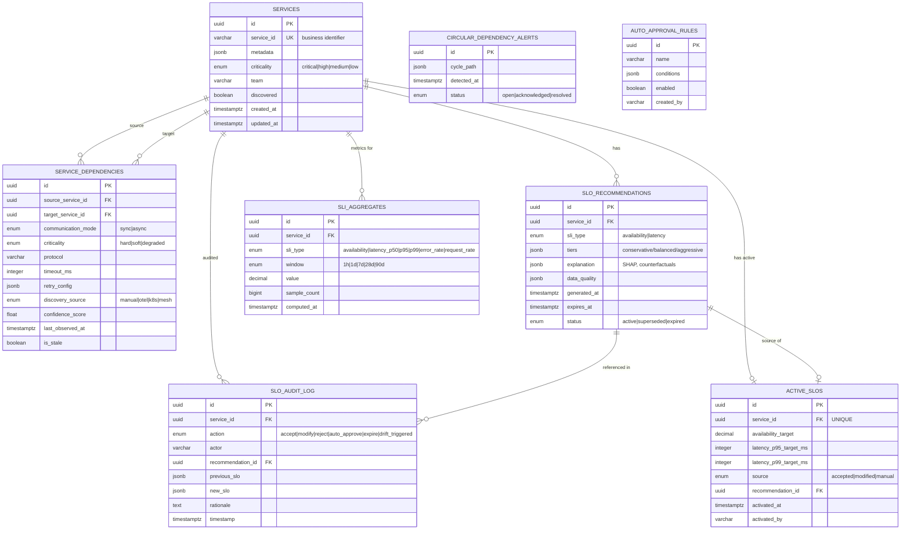

# System Design Document (SDD) — SLO Recommendation Engine

> **Version:** 1.0
> **Date:** 2026-02-14
> **Status:** Draft
> **References:** [PRD](../1_product/PRD.md) | [TRD](./TRD.md)

---

## 1. Problem Statement & Requirements

### What We Are Building

The SLO Recommendation Engine is an AI-assisted backend system that analyzes telemetry data and structural dependencies across 500-5,000+ interconnected microservices to recommend achievable **availability and latency SLOs** for each service.

### Why It Exists

In cloud-native organizations at scale, SLO setting is manual, error-prone, and fails to account for the interconnected nature of distributed systems:

1. **Dependencies are invisible** — A checkout service depending on an unreliable external payment API inherits that unreliability, yet its SLO is set independently.
2. **Cascading failures are not modeled** — Four services at 99.9% each yield ~99.6% composite, but SLOs are set in isolation.
3. **SLOs become stale** — Deployments, traffic growth, and infrastructure shifts continuously move performance baselines.
4. **Latency composition is non-linear** — Tail latency amplifies across call chains; five parallel calls each at p99 < 100ms yield only 95% chance all finish under 100ms.

### Key Technical Challenges Shaping the Architecture

| Challenge | Architectural Implication |
|-----------|--------------------------|
| Dependency-aware computation | Graph storage with efficient traversal (recursive CTEs, cycle detection) |
| Composite reliability math | Serial/parallel availability formulas + end-to-end trace-based latency measurement |
| Explainability requirement | SHAP-based feature attribution, counterfactual analysis from day one |
| Semi-automated governance | Full audit trail, human-on-the-loop approval workflow, graduation path to automation |
| Scale (5,000+ services) | Pre-computed aggregates, caching, async background processing |
| Integration with existing stack | Query Prometheus/Mimir — do not duplicate telemetry data |

---

## 2. High-Level Architecture Overview

The system follows **Clean Architecture** principles with three distinct layers (Domain → Application → Infrastructure) and integrates with an existing OpenTelemetry + Prometheus + Grafana observability stack.

### System Context Diagram


### Architectural Style

The system is a **modular monolith** deployed as two Kubernetes workloads:

1. **API Server** — FastAPI application serving the REST API (synchronous request handling)
2. **Background Worker** — Celery workers executing async tasks (batch aggregation, drift detection, graph analysis)

Both share the same codebase and domain logic. This avoids premature microservice decomposition while maintaining clear separation of concerns through Clean Architecture layers.

### Core Design Principle: Query, Don't Store

The single most important architectural decision is that the SLO Engine **queries existing Prometheus/Mimir metric stores** rather than ingesting raw telemetry. This:
- Eliminates data duplication across the organization
- Leverages existing infrastructure investment
- Reduces the system's operational footprint to PostgreSQL + Redis + the application itself

---

## 3. System Components & Services

### Component Diagram


### Component Responsibilities

| Component | Responsibility | Layer |
|-----------|---------------|-------|
| **Auth Middleware** | Validates API keys (bcrypt-hashed) and JWT tokens (OIDC/JWKS). Enforces RBAC (sre_admin, service_owner, viewer). | Infrastructure |
| **Rate Limiter** | Token-bucket rate limiting per client, backed by Redis for distributed consistency. | Infrastructure |
| **API Routes** | FastAPI route handlers. Input validation via Pydantic. OpenAPI 3.0 auto-generation. RFC 7807 error responses. | Infrastructure |
| **IngestDependencyGraph** | Validates, merges, and upserts dependency graph from multiple sources. Triggers Tarjan's SCC detection. | Application |
| **GenerateRecommendation** | Orchestrates the full recommendation pipeline: fetch SLI data → retrieve subgraph → compute composite bounds → calculate tiers → generate explanations. | Application |
| **RunImpactAnalysis** | Reverse-traverses the graph to identify upstream services affected by a proposed SLO change. | Application |
| **ManageRecommendationLifecycle** | Handles accept/modify/reject workflow. Writes to audit log. Updates active SLOs. | Application |
| **DependencyGraph Entity** | Domain model for the service graph. Encodes nodes, edges, edge annotations, SCC supernodes. Implements graph traversal logic. | Domain |
| **SLO Calculator** | Pure domain logic for composite availability (serial/parallel), latency tier computation, confidence intervals via bootstrap resampling. | Domain |
| **Explainability Engine** | SHAP-based feature attribution, counterfactual analysis, natural-language summary generation. | Domain |
| **Drift Detection Ensemble** | Page-Hinkley + ADWIN + KS-test with majority voting. Triggers SLO re-evaluation on confirmed drift. | Domain |
| **Cold-Start Strategy** | Archetype matching for services with <30 days of data. Extends lookback windows. Flags low confidence. | Domain |
| **Prometheus Query Client** | PromQL query builder. Circuit-breaker wrapped (10 failures → 30s open). Exponential backoff retries. | Infrastructure |
| **Celery Workers** | Executes background tasks: hourly SLI aggregation, 15-min drift detection, post-ingestion graph analysis. | Infrastructure |

---

## 4. Data Architecture

### 4.1 Data Models (ERD)



### 4.2 Data Flow


### 4.3 Storage Strategy

| Store | Technology | Purpose | Rationale |
|-------|-----------|---------|-----------|
| **Primary Database** | PostgreSQL 16+ | Graph storage, SLO data, audit logs, SLI aggregates | Recursive CTEs for graph traversal. JSONB for flexible metadata. Proven at scale. Partitioning support for large tables. |
| **Cache & Rate Limiting** | Redis 7+ | Recommendation cache (24h TTL), rate limit counters, Celery broker, distributed locks | Sub-millisecond reads for cached recommendations. Token bucket implementation. |
| **Time-Series Metrics** | Prometheus / Mimir (external) | Historical SLI data, infrastructure metrics | **Queried, not owned.** Avoids data duplication. Leverages existing retention policies. |
| **Trace Storage** | Grafana Tempo (external) | End-to-end latency distributions | **Queried, not owned.** Used on-demand for latency SLO computation. |

**Partitioning:** `sli_aggregates` is partitioned by `computed_at` (monthly partitions). Hourly granularity retained for 90 days; daily aggregates retained for 1 year.

**Estimated Storage (5,000 services, 1 year):** ~70 GB total, dominated by `sli_aggregates` (~65 GB).

---

## 5. API Design Strategy

### Interaction Pattern

- **Protocol:** REST over HTTPS (TLS 1.3)
- **Specification:** OpenAPI 3.0, auto-generated from Pydantic models via FastAPI
- **Versioning:** URL path (`/api/v1/`)
- **Serialization:** JSON (`application/json`)
- **Pagination:** Cursor-based for list endpoints
- **Errors:** RFC 7807 Problem Details

### Endpoint Summary

| Method | Endpoint | Description | Latency Target |
|--------|----------|-------------|----------------|
| POST | `/api/v1/services/dependencies` | Bulk upsert dependency graph | < 30s (async, 202 Accepted) |
| GET | `/api/v1/services/{id}/dependencies` | Get dependency subgraph | < 500ms |
| GET | `/api/v1/services/{id}/slo-recommendations` | Get SLO recommendations | < 500ms (cached), < 5s (regenerate) |
| POST | `/api/v1/services/{id}/slos` | Accept/modify/reject | < 500ms |
| POST | `/api/v1/slos/impact-analysis` | Run impact analysis | < 10s |
| GET | `/api/v1/health` | Liveness check | < 50ms |
| GET | `/api/v1/health/ready` | Readiness check | < 200ms |

### Critical Flow: SLO Recommendation Generation


### Critical Flow: Accept / Modify / Reject Workflow


---

## 6. Technology Stack

| Layer | Technology | Version | Rationale |
|-------|-----------|---------|-----------|
| **Language** | Python | 3.12+ | Team expertise. Rich ML/data ecosystem. Async support via asyncio. |
| **API Framework** | FastAPI | 0.115+ | Async-native, auto-generated OpenAPI docs, Pydantic validation. Chosen over Django REST (heavier) and Flask (less async support). |
| **ORM** | SQLAlchemy | 2.0+ | Async support, mature PostgreSQL integration, type-safe queries. Chosen over Tortoise ORM (less mature) and raw SQL (less safe). |
| **Database** | PostgreSQL | 16+ | Recursive CTEs for graph traversal, JSONB for flexible metadata, table partitioning. Chosen over Neo4j (overkill for MVP graph complexity), MongoDB (weaker consistency). |
| **Cache** | Redis | 7+ | Sub-ms reads, token bucket rate limiting, Celery broker. Chosen over Memcached (less versatile) and in-process cache (not distributed). |
| **Task Queue** | Celery + Redis broker | 5.3+ | Distributed background jobs: batch aggregation, drift detection, graph analysis. Chosen over APScheduler (not distributed) and Dramatiq (smaller ecosystem). |
| **ML / Explainability** | scikit-learn, shap, scipy, river | Latest stable | MVP rule-based models + statistical methods. SHAP for explainability. river for streaming drift detection. |
| **Telemetry Client** | prometheus-api-client | Latest | PromQL queries against Prometheus/Mimir remote read API. |
| **Migrations** | Alembic | Latest | SQLAlchemy-native schema versioning. All migrations are reversible. |
| **Containerization** | Docker | Latest | Multi-stage builds (builder + runtime). |
| **Orchestration** | Kubernetes | 1.28+ | Deployment, HPA scaling, health checks, rolling updates. |
| **CI/CD** | GitHub Actions | N/A | Build, test (pytest + testcontainers), lint (ruff), type-check (mypy --strict), security scan (bandit + pip-audit). |

---

## 7. Scalability & Performance Strategy

### Scaling Model


### Performance Strategy

| Strategy | Implementation | Target |
|----------|---------------|--------|
| **Pre-computed aggregates** | Hourly batch job writes SLI aggregates to PostgreSQL. Recommendations served from cache. | Recommendation retrieval < 500ms (p95) |
| **Caching** | Redis cache with 24h TTL for recommendations. Invalidated on graph change, drift, or SLO acceptance. | Cache hit rate > 80% |
| **Async processing** | Dependency graph ingestion returns 202 Accepted. Tarjan's SCC detection runs as background task. Batch aggregation via Celery. | Graph ingestion < 30s (1000 services) |
| **Efficient graph traversal** | PostgreSQL recursive CTEs with partial indexes (`WHERE NOT is_stale`). Cycle prevention in CTE via path arrays. | 3-hop traversal < 100ms (5000 services) |
| **Connection pooling** | PgBouncer or SQLAlchemy pool (max 50 connections per instance). | No connection exhaustion under load |
| **Horizontal scaling** | API pods scale on CPU > 70% or p95 latency > 400ms. Worker pods scale on queue depth > 100. | 200+ concurrent users |

### Auto-Scaling Triggers

| Component | Metric | Threshold | Action |
|-----------|--------|-----------|--------|
| API pods | CPU utilization | > 70% | HPA: 3 → 10 pods |
| API pods | p95 response latency | > 400ms | HPA: 3 → 10 pods |
| Worker pods | Celery queue depth | > 100 tasks | HPA: 2 → 8 pods |
| PostgreSQL | Connection count | > 80% of max | Add PgBouncer or vertical scale |
| Redis | Memory usage | > 80% | Vertical scale or Redis Cluster |

---

## 8. Security Architecture

### Authentication & Authorization Flow


### Security Controls

| Control | Implementation |
|---------|---------------|
| **Transport** | TLS 1.3 mandatory. HTTP → HTTPS redirect. HSTS header. |
| **API Key Storage** | bcrypt (cost factor 12). Raw keys never stored or logged. |
| **JWT Validation** | Signature verified against IdP JWKS endpoint. Token cache TTL: 5 min. |
| **Input Validation** | All inputs via Pydantic strict models. Max request body: 10 MB. |
| **SQL Injection** | SQLAlchemy ORM or parameterized queries only. No raw string interpolation. |
| **PII Prevention** | Metric label sanitization — reject labels matching PII patterns (email, IP, UUID-like user IDs). |
| **Audit Immutability** | `slo_audit_log` table: no UPDATE/DELETE grants at the database level. Application ORM enforces append-only. |
| **Rate Limiting** | Token bucket per client (API key or OAuth2 subject). Redis-backed for distributed consistency. Returns 429 with Retry-After header. |
| **Secrets Management** | All secrets via environment variables or Kubernetes Secrets. Never in source code or config files. |

---

## 9. Deployment Architecture

### Environment Topology


### CI/CD Pipeline

```
Push to main / PR
    │
    ├─ Stage 1: Validate (parallel)
    │   ├── ruff (linting)
    │   ├── mypy --strict (type checking)
    │   └── bandit + pip-audit (security)
    │
    ├─ Stage 2: Test (parallel)
    │   ├── pytest unit tests (coverage: 90% domain/app)
    │   ├── pytest integration (testcontainers: PG + Redis)
    │   └── schemathesis (API contract tests from OpenAPI spec)
    │
    ├─ Stage 3: Build
    │   ├── Docker multi-stage build
    │   └── Push to registry (tagged: git SHA + semver)
    │
    ├─ Stage 4: Deploy Staging
    │   ├── Helm upgrade --install
    │   ├── Smoke tests
    │   └── Load test (Locust, 5-min burst)
    │
    ├─ Stage 5: Deploy Production [manual approval gate]
    │   ├── Rolling update (maxUnavailable: 0, maxSurge: 1)
    │   ├── Readiness probe gates traffic
    │   └── Post-deploy smoke test
    │
    └─ Stage 6: Post-Deploy Validation
        ├── Monitor 5xx rate for 15 minutes
        └── Auto-rollback if 5xx > 1%
```

### Zero-Downtime Deployment

- **Rolling updates:** `maxUnavailable: 0` ensures no capacity loss during deployment.
- **Readiness probe:** `/api/v1/health/ready` checks DB, Redis, and Prometheus connectivity. Pod only receives traffic after passing.
- **Graceful shutdown:** 30-second drain period for in-flight requests before SIGTERM.

---

## 10. Trade-offs & Alternatives

### Key Architectural Decisions

| Decision | Choice | Alternative Considered | Rationale |
|----------|--------|----------------------|-----------|
| **Graph storage** | PostgreSQL with recursive CTEs | Neo4j | PostgreSQL is sufficient for 10,000+ edges with proper indexing. Avoids introducing a new database technology. Neo4j deferred unless graph analytics (PageRank, community detection) prove necessary. |
| **Telemetry strategy** | Query existing Prometheus/Mimir | Build dedicated time-series store | Eliminates data duplication. Reduces operational burden. Acceptable trade-off: dependent on Prometheus availability (mitigated by circuit breaker + cached fallback). |
| **ML approach** | Rule-based composite math (MVP) → GNN + TFT (Phase 5) | Full ML from day one | Rule-based is transparent, testable, and ships faster. ML deferred until the system has enough feedback data to train on. Phased approach builds trust. |
| **Latency SLO computation** | End-to-end trace measurement | Mathematical composition of percentiles | Percentiles are non-additive (p99 of sum ≠ sum of p99s). Trace-based measurement is mathematically correct for latency SLOs. Trade-off: depends on Tempo availability. |
| **Deployment model** | Modular monolith (2 workloads) | Microservices | Avoids premature decomposition. Single codebase with Clean Architecture layers provides clear boundaries. Can extract services later if needed. |
| **Task queue** | Celery + Redis | APScheduler / Kafka Streams | Celery provides distributed execution with visibility. Redis dual-purposed as broker and cache. Kafka deferred (no streaming requirements for MVP). |
| **Approval model** | Semi-automated (human-on-the-loop) | Full automation | Trust is earned, not assumed. Auto-approval rules (FR-11) provide graduation path without architectural changes. |
| **External dependency handling** | Use observed availability, not published SLA | Trust provider SLAs | Published SLAs are often overstated. Observed data is ground truth. 10% pessimistic adjustment when no monitoring data exists. |

---

## 11. Risks & Mitigation

| Risk | Impact | Probability | Mitigation |
|------|--------|-------------|------------|
| **Prometheus query latency spikes** during high-traffic periods | Recommendation generation exceeds 5s target | High | Pre-compute aggregates in batch. Circuit breaker on Prometheus client (10 failures → 30s open). Query Mimir (long-term store) for historical queries. Serve stale cached recommendations as fallback. |
| **PostgreSQL recursive CTE performance degrades** at >10,000 edges | Graph traversal exceeds 100ms target | Medium | Benchmark early with production-scale data. Partial indexes on non-stale edges. If insufficient, migrate graph queries to Neo4j or materialized adjacency tables. |
| **Incomplete dependency graph** from partial OTel instrumentation | Recommendations miss critical dependencies | High | Multi-source discovery (traces + mesh + K8s + manual). Confidence scores per edge based on source count and freshness. Divergence alerting when runtime graph differs from declared config. |
| **SRE distrust of recommendations** | Low adoption, system becomes shelfware | Medium | Explainability from day one (SHAP, counterfactuals, natural-language summaries). Start with non-critical services. Capture feedback loop. Never auto-apply without explicit opt-in. |
| **Schema migrations on large sli_aggregates table** | Extended downtime during migrations | Medium | Partition table from day one (monthly by computed_at). Use `pg_repack` for zero-lock rewrites. Test all migrations on staging with production-scale data. |
| **Celery worker memory leaks** from long-running batch jobs | Worker OOM kills, missed aggregation cycles | Medium | Set `worker_max_tasks_per_child=100` to recycle workers. Monitor RSS via container metrics. Use `--pool=prefork` for process isolation. |
| **Redis failure** takes down rate limiting and caching | API unprotected from abuse; all requests hit DB | Low | Rate limiting falls back to in-process token bucket (per-instance). Cache miss falls back to direct Prometheus queries (higher latency but functional). |

---

## 12. Future Considerations

### Phase 3-4: Intelligence & Adaptation (Post-MVP)

- **Drift Detection Ensemble:** Page-Hinkley + ADWIN + KS-test with majority voting. Background worker runs every 15 minutes per service. Confirmed drift triggers recommendation re-evaluation and service owner notification.
- **Burn-Rate Alert Generation:** Auto-generate Prometheus recording rules in Google SRE multi-window format (14.4x/1h, 6x/6h, 1x/3d) for each accepted SLO.
- **Auto-Approval Rules Engine:** Configurable policies for low-criticality services (e.g., "auto-accept Balanced tier for `criticality: low` with confidence > 0.85"). All auto-approvals logged with full audit trail.
- **Organizational Dashboard:** Pre-computed materialized views for SLO coverage, error budget health, and recommendation quality metrics.

### Phase 5: Scale & Graduate

- **GNN + Temporal Fusion Transformer:** Graph Attention Network for structural dependency modeling fused with TFT for temporal forecasting. Enables proactive SLO violation prediction beyond rule-based composite math.
- **SLO-as-Code Export:** OpenSLO YAML format for GitOps workflows. Sloth-compatible YAML for Prometheus recording rules. PR-based workflow to SLO config repository.
- **Composite / Journey-Level SLOs:** Aggregate multiple service SLOs into user-journey SLOs (e.g., "checkout journey"). Monte Carlo simulation for complex mixed topologies.
- **What-If Scenario Modeling:** Interactive simulation of architectural changes (adding circuit breakers, async queues, fallback providers) on achievable SLOs.
- **Neo4j Migration:** If graph analytics requirements emerge (PageRank for service importance, community detection for blast radius), migrate graph storage from PostgreSQL to Neo4j.

### Known Limitations

1. **Single-region deployment** — Multi-region support requires addressing data replication, split-brain graph scenarios, and regional Prometheus federation.
2. **No throughput or correctness SLOs** — MVP covers availability and latency only. Throughput SLOs require request-rate modeling; correctness requires domain-specific validation.
3. **No real-time alerting** — The system recommends SLO targets and alert configurations but does not replace Prometheus Alertmanager for runtime alerting.
4. **Correlated failures not modeled in MVP** — Composite availability math assumes independent failures. Shared infrastructure (same region, same network) creates correlated failure modes. Monte Carlo simulation in Phase 5 addresses this.
